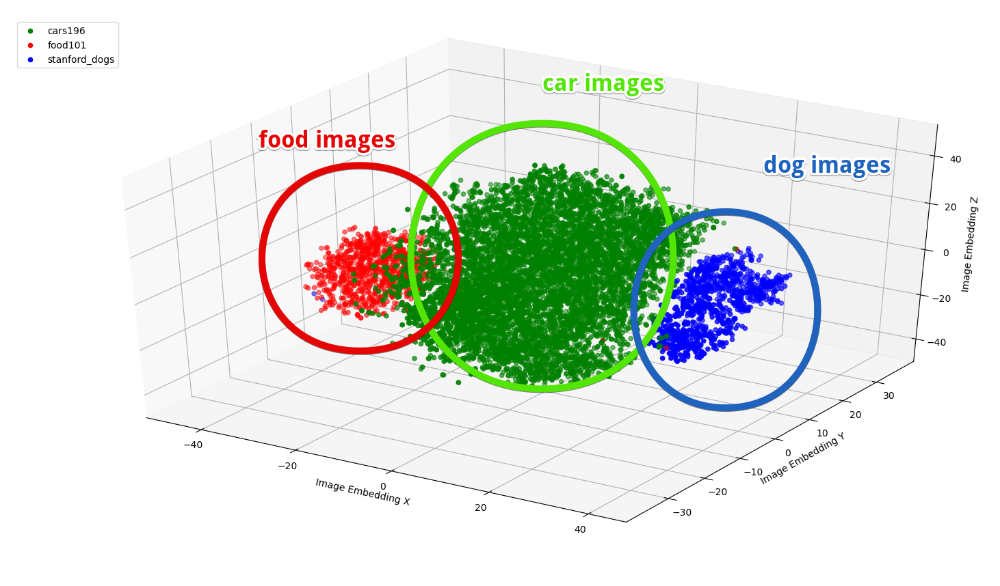

## Project Gadget

Gadget is an Image Embedding Based Search & Data-centric AI Exploration Engine with the primary focus
being proactively explore and look for Small / Smart Data that makes your DNN model stand out.

Image embedding vectors are the crucial pieces of fundamental elements throughout the whole system design.
We will try to use various DNN frameworks (Image Classification, EfficientNet, Vision Transformer),
Object Detection, Instance Segmentation, maskRCNN, etc.) to study embedding vectors.

#### Author: joe.xing.ai@gmail.com

### Design

The main idea behind this design is try to train an Agent (Reinforcement Learning, Imitation Learning,
or other Heuristic based) that explores and exploits the image embedding space, thus try to determine the
value of a particular embedding vector state with the associated policy to reach such state. That value function
and policy function can be used to improve DNN model performance through providing Small / Smart Data to the model.

Here the embedding vector could be time-dependent, and used to compose behavioral embedding, e.g. U-turn embedding
with a few frames of images showing the car's movement and pose within the image.

The model architect:

The system architect:

### Setup

Main dependencies: conda 4.10.1, CUDA 10.1, tensorflow-gpu 2.3.0

    - conda env create --file environment_ubuntu.yaml (environment_windows.yml)

For now we only support Ubuntu and Windows 10 OS

    - conda activate gadget
    - cd ./python/ && python main.py --download --dataset_name "food01" --image_folder "./data/food01"

These initialization procedures will start to download Tensorflow standard datasets.

### QA System - Sanity Checks, Qualitative & Quantitative Measurements of the Model Performance

#### (a) Distribution of Image Embedding Vectors

We should always visualize how the Image Embedding Vectors distribute in Euclidean Space after the dimensionality
reduction. The figure shows a sanity check for distributions of embedding vectors for 3 different classes of images:
images that have car, food and dogs within the ROI. The embedding vectors are nicely separated and showing clustering 
behaviors in phase space. We take 3 classes of image data from the Tensorflow standard sample dataset, "cars196",
"food101" and "stanford_dogs".

  

#### (b) Image Search Results

### Deployment

