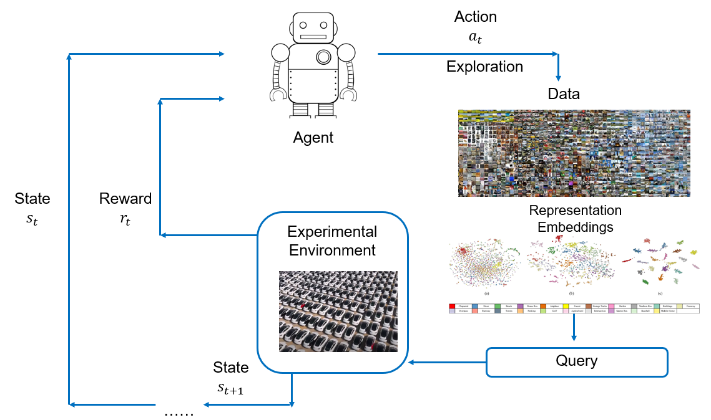
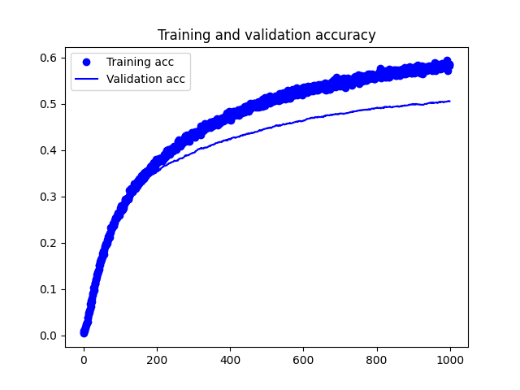

## Project Gadget

Gadget is an Image Embedding Based Active Learning Engine with the primary focus being proactively explore and look 
for Most Informative Data (usually small and smart data) that makes your DNN model stand out.

Image embedding vectors are the crucial pieces of fundamental elements throughout the whole design. We will try to use
various DNN frameworks (Image Classification, EfficientNet, Vision Transformer), Object Detection, Instance 
Segmentation, maskRCNN, etc.) to study embedding vectors.

#### Author: joe.xing.ai@gmail.com

### Design

The main idea behind this Active Learning framework is to train an Agent (Reinforcement Learning, Imitation Learning, 
or other Heuristic based) that explores and exploits the image embedding space of general data, thus try to determine 
the value of a particular embedding vector state with the associated policy to select such most informative data.

Here the embedding vector could be time-dependent, and used to compose behavioral embedding, e.g. U-turn embedding
with a few frames of images showing the car's movement and pose within the image. A policy function could essentially
be learned to select Most Informative Behaviors as well.

#### The Model Architecture:

  

#### The System Architecture:

Define the system input data pipeline, model deployment CICD, reinforcement signal collection system, etc. TBD

### Setup

Main dependencies: conda 4.10.1, CUDA 10.1(2), cuDNN 7.6.4 (works with CUDA 10.2 as well), tensorflow-gpu 2.3.0,
torch 1.7.1

    - conda env create --file environment_ubuntu.yaml (environment_windows.yml)

For now we only support Ubuntu and Windows 10 OS

    - conda activate gadget
    - cd ./python/ && python main.py --download --dataset_name "food01" --image_folder "./data/food01"

These initialization procedures will start to download Tensorflow standard datasets.

### Experimental Setup

We utilize sample data provided by Tensorflow Datasets (https://www.tensorflow.org/datasets) such as car images,
food, dog images, etc. On this particular example below, we have ~8000 images of various types of cars, another
~1000 images for food, dog specifically as control samples.

#### (a) Distribution of Image Embedding Vectors

We should always visualize how the Image Embedding Vectors distribute in Euclidean Space after the dimensionality
reduction. The figure shows a sanity check for distributions of embedding vectors for 3 different classes of images:
images that have car, food and dogs within the ROI. The embedding vectors are nicely separated and showing clustering 
behaviors in phase space. We take 3 classes of image data from the Tensorflow standard sample dataset, "cars196",
"food101" and "stanford_dogs".

  

#### (b) Image Search Results

Here below we demonstrate using the image embedding vector to perform image search, where the top row has the "query"
or "probe" image while the bottom row shows the Top-5 matches ranked from high to low similarity from left to right.

  

  

#### (c) RL Agent Select Most Informative Data (MID) and Re-training the CNN Model

An experiment is carried out using about 16, 000 car images for training and testing (almost 50-50 split)
Credits on data preparation goes to Cars196 dataset: https://ai.stanford.edu/~jkrause/cars/car_dataset.html

Here the baseline Conv. Net framework could be anything from EfficientNet, Inception, Vision Transformer, so on and so 
forth. We are going to freeze the Conv. Net model parameters which were obtained using sort of standard training data 
such as ImageNet data and only re-train the last layer that classifies the 196 types of cars. A baseline model
performance is shown below where the top-1 accuracy is foreseen to converge around 70% precision with 8000 training
images.

  

### Deployment

Docker-based micro-service, TBD

